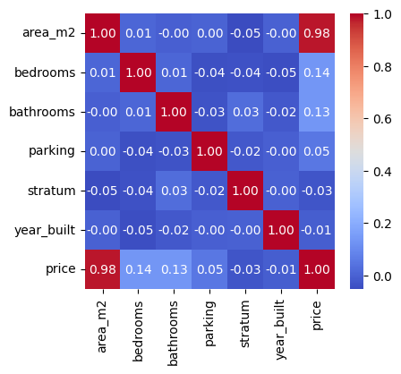
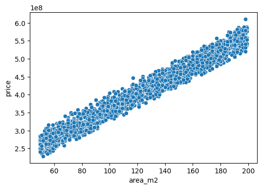

# API para la Predicción de Precios de Vivienda

API, desarrollada en Flask, para la predicción de precios de vivienda. La predicción de los precios de vivienda se realiza mediante un modelo de regresión lineal; sin embargo, se provee un endpoint que permite sustituir el modelo y un script que facilita el entrenamiento de otros modelos.

## Índice

- [Análisis exploratorio de datos](#análisis-exploratorio-de-datos)
- [Preprocesamiento](#preprocesamiento)
- [Modelos de regresión](#modelos-de-regresión)
- [Instalación](#instalación)
- [Entrenamiento de un modelo](#entrenamiento-de-un-modelo)
- [Ejecución de la API](#ejecucion-de-la-api)
- [Consumo de la API](#consumo-de-la-api)
- [Pruebas](#pruebas)

## Análisis exploratorio de datos

El análisis exploratorio de los datos puede ser consultado en `analisis_exploratorio_y_modelos.ipynb` o `analisis_exploratorio_y_modelos.html`.

### Información básica

**Número de ejemplos**: 2000

**Características**

* Numéricas
  * id: Identificador único de la propiedad.
  *   area_m2: Área construida en metros cuadrados.
  *   bedrooms: Número de habitaciones.
  *   bathrooms: Número de baños.
  *   parking: Número de espacios de parqueadero.
  *   stratum: Estrato socioeconómico (1-6).
  *   year_built: Año de construcción.
  *   price: Precio en pesos colombianos.
* Categóricas
  *   neighborhood: Barrio donde está ubicada la propiedad.
  
**Variable objetivo**: price

**Valores nulos**: No

### Distribución de las características 

A continuación, se muestran los estadísticos básicos del conjunto de características. Los histogramas por características pueden ser consultados en `analisis_exploratorio_y_modelos.html`.

|      | id           | area_m2      | bedrooms     | bathrooms    | parking      | stratum      | year_built   | price         |
|------|--------------|--------------|--------------|--------------|--------------|--------------|--------------|---------------|
| count| 2000.000000  | 2000.000000  | 2000.000000  | 2000.000000  | 2000.000000  | 2000.000000  | 2000.000000  | 2.000000e+03  |
| mean | 1000.500000  | 124.272000   | 2.506500     | 2.011000     | 0.996500     | 3.463500     | 2000.650500  | 4.103182e+08  |
| std  | 577.494589   | 44.081068    | 1.136047     | 0.820497     | 0.811059     | 1.702386     | 12.372627    | 8.994833e+07  |
| min  | 1.000000     | 50.000000    | 1.000000     | 1.000000     | 0.000000     | 1.000000     | 1980.000000  | 2.290000e+08  |
| 25%  | 500.750000   | 86.000000    | 1.000000     | 1.000000     | 0.000000     | 2.000000     | 1990.000000  | 3.360000e+08  |
| 50%  | 1000.500000  | 123.500000   | 3.000000     | 2.000000     | 1.000000     | 3.000000     | 2001.000000  | 4.099000e+08  |
| 75%  | 1500.250000  | 163.000000   | 4.000000     | 3.000000     | 2.000000     | 5.000000     | 2011.000000  | 4.878500e+08  |
| max  | 2000.000000  | 199.000000   | 4.000000     | 3.000000     | 2.000000     | 6.000000     | 2022.000000  | 6.110000e+08  |

Los histogramas sugieren distribuciones uniformes en las características, con excepción de price. Asimismo, se evidencia la no presencia de valores atípicos en ninguna de las características en los histogramas y estadísticos.

El histograma y el rango intercuartílico de la variable *price* muestra una concentración de los datos entre los 275 y los 525 millones.

### Análisis de correlación

No existe una correlación significativa entre las características distintas del objetivo. Existe una correlación fuerte entre el área y el precio de la vivienda (0.98). 



Se observa una relación lineal entre *area_m2* y *price*, lo que sugiere un regresor lineal como candidato para el modelo a entrenar.



## Preprocesamiento

De manera previa al preprocesamiento y entrenamiento de los modelos, se divide el conjunto de datos en 80% para entrenamiento y 20% para prueba.

### Valores faltantes

El conjunto de datos original no contiene valores faltantes, no obstante, se generan imputadores en caso de que existan valores faltantes en los nuevos datos. Los valores faltantes en las características numéricas serán imputados usando la media del conjunto de entrenamiento. En la variable categórica (neighborhood), los valores faltantes serán imputados usando la moda en el conjunto de entrenamiento.

### Codificación de variables categóricas

La variable categórica *neighborhood* será codificada usando la estrategia one-hot encoding (hay un total de 7 categorías). No se omite ninguna categoría para manejar la presencia de nuevas categorías en nuevos datos.

### Normalización

Las variables numéricas se normalizan al rango [0, 1].

## Modelos de regresión

Se consideran distintos algoritmos de regresión: regresión lineal, árbol de decisión, random forest, perceptrón multicapa, KNN, gradient boosting y XGBoost.

Para cada uno de los algoritmos, se generan modelos con diferentes combinaciones de hiperparámetros usando grid search y validación cruzada de 10 folds. Las combinaciones de hiperparámetros probadas y el proceso de entrenamiento en detalle pueden ser consultados en  `analisis_exploratorio_y_modelos.ipynb` y `analisis_exploratorio_y_modelos.html`.

Los modelos de regresión lineal, XGBoost, Gradiente boosting, árbol de decisión y random forest mostraron un desempeño adecuado. Los resultados de estos modelos sobre el conjunto de prueba se muestran a continuación:

| Modelo                               | RMSE           | MAE            | R^2           |
|--------------------------------------|----------------|----------------|---------------|
| Gradient Boosting                    | 2,429,695.57   | 1,879,969.76   | 0.9993        |
| Regresión Lineal (Regularización L2) | 2,572,281.80   | 1,807,946.06   | 0.9992        |
| Regresión Lineal (Regularización L1) | 2,572,840.19   | 1,807,430.28   | 0.9992        |
| XGBoost                              | 4,058,052.50   | 3,195,730.00   | 0.9980        |
| Random Forest                        | 6,450,222.41   | 4,948,846.25   | 0.9949        |
| Árbol de Decisión                    | 9,714,180.02   | 7,585,163.69   | 0.9884        |

## Instalación

Siga estos pasos para instalar las dependencias de la aplicación:

1. Clone el repositorio:

    ```bash
    git clone https://github.com/eaninov/house-price-prediction.git
    cd house-price-prediction
    ```

2. Cree y active un entorno virtual:

    ```bash
    python3 -m venv venv
    source venv/bin/activate  # `venv\Scripts\activate` en Windows
    ```

3. Instale las dependencias del proyecto:

    ```bash
    pip install -r requirements.txt
    ```

## Entrenamiento de un modelo

Para garantizar la validez de las métricas reportadas por el sistema (mediante el endpoint /metrics), todos los modelos deben ser entrenados a partir de la misma división del conjunto de datos

 ```python
X_train, X_test, y_train, y_test = train_test_split(X, y, test_size=Config.TEST_SIZE, random_state=Config.SPLITTING_RANDOM_STATE)
```

También es posible entrenar el modelo sobre un conjunto de datos nuevo.

`scripts/train.py` permite el entrenamiento de nuevos modelos sobre el conjunto de datos original. Para entrenar un modelo, siga los pasos a continuación:

1. Abra `scripts/train.py`.

2. Seleccione el tipo de modelo que desea entrenar. El diccionario `algorithms` contiene configuraciones predeterminadas para entrenar distintos tipos de modelos (`dummy`, `ridge`, `lasso`, `decision_tree`, `random_forest`, `mlp`, `knn`, `gradient_boosting` y `xgboost`). Si desea utilizar un algoritmo o combinación de hiperparámetros distinta, debe agregar la configuración correspondiente al diccionario `algorithms`.

3. Sustituya la última línea del script por
 ```python
    create_model(<nombre_de_su_modelo>)
```

4. Ejecute el siguiente comando:

    ```bash
    python scripts/train.py
    ```

5. Una vez entrenado, el modelo será guardado en el directorio `models/` con el nombre `<nombre_de_su_modelo>.pkl`. Adicionalmente, se creará un objeto para el preprocesamiento de los datos (ver [Preprocesamiento](#preprocesamiento)) con el nombre `preprocessor.pkl`.

## Ejecución de la API

Para ejecutar la API, siga estos pasos:

1. Asegúrese de que el entorno virtual esté activado y las dependencias estén instaladas.

2. Ejecute la aplicación Flask:

    ```bash
    python run.py
   ```
   La API estará disponible en `http://127.0.0.1:5000/`.

## Consumo de la API

Una vez que la API esté corriendo, puede realizar peticiones a los siguientes endpoints:

### `/predict` (POST)

Recibe los atributos de una propiedad (`area_m2`, `bedrooms`, `bathrooms`, `parking`, `stratum`, `year_built`, `neighborhood`) en formato json, y retorna el precio estimado, en formato json.

**Ejemplo de solicitud:**

Usando `curl`:

```bash
curl -L -X POST http://127.0.0.1:5000/predict \
    -H "Content-Type: application/json" \
    -d "{
         \"area_m2\": 90,
         \"bedrooms\": 3, 
         \"bathrooms\": 2, 
         \"parking\": 1, 
         \"stratum\": 4, 
         \"year_built\": 2000, 
         \"neighborhood\": \"Bosa\"}"
```

**Respuesta esperada:**

```json
{
    {"predicted_price": 404975042.6673465}
}
```

### `/metrics` (GET)

Retorna las métricas de desempeño del modelo sobre el conjunto de prueba: `RMSE`, `MAE`, `MSE` y `R^2`. 

**Ejemplo de solicitud:**

Usando `curl`:

```bash
curl -L -X GET http://127.0.0.1:5000/metrics
```

**Respuesta esperada:**

```json
{
    "MAE": 1807946.0595252472,
    "MSE": 6616633638930.69,
    "RMSE": 2572281.796174496,
    "R^2": 0.9991841577423154
}
```

### `/health` (GET)

Retorna un json indicando si el modelo se encuentra cargado.

**Ejemplo de solicitud:**

Usando `curl`:

```bash
curl -L -X GET http://127.0.0.1:5000/health
```

**Respuesta esperada:**

```json
{
    "model_loaded": true,
    "preprocessor_loaded": true,
    "status": "healthy"
}
```

### `/update-model` (POST)

Permite actualizar el modelo y el preprocesador.

**Ejemplo de solicitud:**

Usando `curl`:

```bash
curl -L -X POST http://127.0.0.1:5000/update-model \
     -F "model=@models/gradient_boosting.pkl" \
     -F "preprocessor=@models/preprocessor.pkl"
```

**Respuesta esperada:**

```json
{
  "message": "Modelo actualizado."
}
```

## Pruebas

La aplicación incluye un conjunto de pruebas automatizadas sobre los endpoints. Para ejecutar las pruebas, es necesario que el servicio se encuentre en ejecución.

Ejecute las pruebas usando `pytest`.
   ```bash
      python -m pytest
   ```

Si desea probar un endpoint en particular, debe especificar el archivo de test correspondiente `test_<endpoint>.py`.

```bash
   python -m pytest test_predict.py
```
